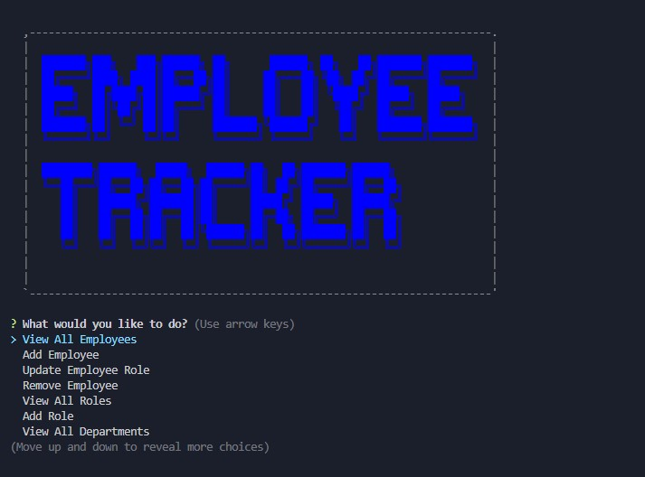

# Employee Tracker

## Description

This project is designed to be a content management system (CMS) that allows a particular organization to complete CRUD actions and manage their employee database.

## Table of Contents

- [Installation](#installation)

- [Usage](#usage)

- [License](#license)

- [Contributing](#contributing)

- [Tests](#tests)

- [Screenshot](#screenshot)

- [Questions](#questions)

## Installation

To install dependencies, run the below command:

    npm i

## Usage

Install dependenices and seed the database

## License

This project is licensed under the MIT license.

## Contributing

Feel free to contribute!

## Tests

To run tests, run the below command:

    npm test

## Screenshot

## Demo Video Link:

- https://watch.screencastify.com/v/CYODrvbcENVmKGMxMavH

## Questions

If you have questions about this repo, you can contact me at davistr1216@gmail.com. You can find more of my work on [GitHub](https://github.com/davistr)
